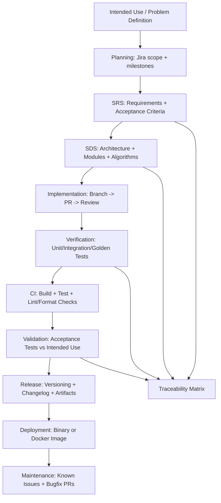

# Lecture 3 - SDLC Documentation & Traceability

In this lecture, we introduce a repository structure that aligns with the Software Development Life Cycle (SDLC), ensuring that each stage of development produces clear, reviewable documentation and specific artifacts (e.g., SRS/SDS, tests, workflows) for planning, requirements, design, implementation, testing, CI, validation, and release. Throughout the workflow, you will carry forward consistent IDs to maintain end-to-end traceability—from the original intended use, through requirements and design, to tests, acceptance criteria, and releases—so the engineering process is reproducible and auditable, not just a way to deliver code.

## Complete end-to-end workflow

| Step | Phase | What you do (key points) | Outputs (artifacts) | Traceability hooks (IDs to carry forward) |
|---:|---|---|---|---|
| 1 | Intended Use / Problem Definition | Define user need, constraints, non-goals, success criteria. | `docs/00_intended_use.md` | Define **IU-\*** (e.g., IU-1, IU-2) |
| 2 | Project Planning (PM + scope control) | Break down work (Epics/Stories), milestones, definition of done, roles (builder vs collaborator). | Jira board, `docs/01_plan.md` | Jira tickets reference **IU-\*** and later map to **FR-\***/**NFR-\*** |
| 3 | SRS — Software Requirements Specification | FR/NFR, interfaces/CLI, error handling, acceptance criteria. | `docs/02_SRS.md` | Assign requirement IDs **FR-\***, **NFR-\***; each cites **IU-\*** it supports |
| 4 | SDS — Software Design Specification | Architecture/modules, data structures, parsing strategy, algorithms, error model, logging, dependency choices. | `docs/03_SDS.md` (+ diagrams) | Design sections labeled **DS-\***; each DS-\* references covered **FR-\***/**NFR-\*** |
| 5 | Implementation (Coding) | Implement in small increments mapped to Jira tickets; branch per ticket; PR per change. | `src/`, `include/`, `CMakeLists.txt`, commits/PRs | PR/commit messages include: Jira key + **FR-\***/**NFR-\*** + **DS-\*** |
| 6 | Verification (Test) | Unit/integration/golden tests; cover edge/error cases; deterministic outputs. | `tests/`, `docs/04_test_plan.md` | Test IDs **T-\***; each T-\* references **FR-\***/**NFR-\*** (and optionally **DS-\***) |
| 7 | CI (Automated Verification Gate) | Build + test + format/static checks on every PR; protect `main`. | `.github/workflows/ci.yml` | CI jobs named **CI-\***; each CI-\* runs specific **T-\*** suites |
| 8 | Validation (Acceptance Testing) | Confirm Intended Use via acceptance scenarios (black-box CLI runs on provided datasets). | `docs/05_acceptance_tests.md` (or SRS section) | Acceptance tests **AT-\*** mapped to **IU-\*** and **FR-\***/**NFR-\*** |
| 9 | Packaging / Release | Versioning, changelog, release artifacts (binary/container), reproducible build notes. | `CHANGELOG.md`, tag `v1.0.0`, GitHub Release (optional) | Release notes reference included **FR-\***/**NFR-\*** and passing **CI-\*** |
| 10 | Deployment | Course deployment: CLI binary release or Docker image for consistent runs. | `Dockerfile`, `docs/07_deploy.md` | Deployment steps reference release tag + required **CI-\*** status |
| 11 | Maintenance / Operations (lightweight) | Known issues/limitations, bug reporting, minimal monitoring (logs/stats output). | `docs/08_known_issues.md`, `--stats` / logs | Issues reference affected **FR-\***/**NFR-\*** and related **T-\*** regressions |

**Traceability Matrix (embedded via IDs above):** IU-\* → FR-\*/NFR-\* → DS-\* → T-\*/AT-\* → CI-\* (and referenced in PRs/releases).  
*(Optional: generate a one-page table in `docs/06_traceability.md` by listing these ID links.)*

## SDLC Documentation Workflow & Traceability

