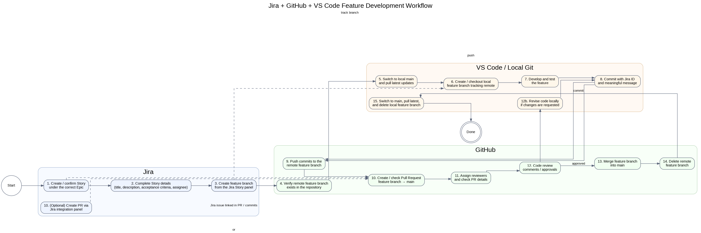

# Lecture 5 -  Jira + GitHub + VS Code Workflow Diagram

This diagram shows the standard **feature development workflow** for students using:
- **Jira** for task tracking
- **GitHub** for remote repository, pull requests, and code review
- **VS Code / Local Git** for development

## Workflow Diagram

## Key Notes

1. Always complete the **Jira Story** before starting implementation.
2. Always update local `main` before checking out the feature branch.
3. Use **Jira ID + meaningful commit message** in every commit.
4. Open the **Pull Request** only after local testing is completed.
5. If reviewers request changes, revise on the same feature branch and push again.
6. After merge, delete both the **remote** and **local** feature branches.
7. Finally, pull the latest `main` so local and remote stay synchronized.

## Mermaid Version

```mermaid
flowchart LR
    A([Start]) --> J1[1. Create / confirm Jira Story under the correct Epic]
    J1 --> J2[2. Complete Story details]
    J2 --> J3[3. Create feature branch from Jira Story panel]
    J3 --> G4[4. Verify remote feature branch in GitHub]
    G4 --> V5[5. In VS Code, switch to local main and pull latest updates]
    V5 --> V6[6. Create / checkout local feature branch tracking remote]
    V6 --> V7[7. Develop and test the feature]
    V7 --> V8[8. Commit with Jira ID and meaningful message]
    V8 --> G9[9. Push commits to remote feature branch]
    G9 --> G10[10. Create / check Pull Request]
    J3 -. linked issue / integration .-> G10
    G10 --> G11[11. Assign reviewers and check PR details]
    G11 --> G12{12. Code review result}
    G12 -->|Approved| G13[13. Merge feature branch into main]
    G12 -->|Changes requested| V12[Revise code locally]
    V12 --> V8
    G13 --> G14[14. Delete remote feature branch]
    G14 --> V15[15. Switch to main, pull latest, and delete local feature branch]
    V15 --> D([Done])
```

